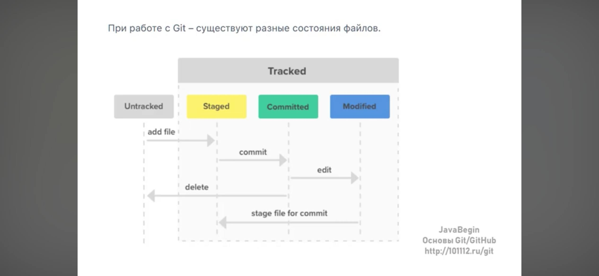
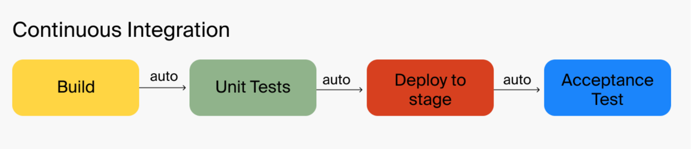
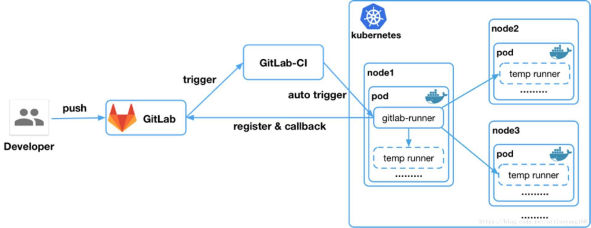

09.07.2026
сегодня делал упражнения с гитом, конкретнее git rebase -i
видос git rebase -> https://youtu.be/smUBOQhG1IM?si=hOiobfJ8VQosWnm3

10.07.2026
Сегодня чуть все не поломал изза версий, нужно быть аккуратнее, смотреть все из корня и несколько раз проверять, что я обновляю
вчера посморел очень интересный курс по ci cd и тимсити, нужно будет проделать домашки в свободное время, а пока что читать/узнавать/смотреть все про кубер

13.07.2026
Сегодня смотрю гайды по тимсити и повторяю на своем компе
КУРС: 3728
построил очень простой пайалайн
- проверка занят ли порт на котором крутиться приложение
- если занят, то удаляем, если нет, идем дальше
- запуск из докер файла внутри проекта
- логи
все это собрано в одном шаге, не знаю насколько это хорошо

14.07.2026
Сегоня собрал новый сценарий в тимсити по дз номер 1 и запушил вот сюда 
https://github.com/Skwoznyak/simple-ps1-script-for-teamcity/tree/publish-docker-image-in-github-container-registory

второй урок начал, но было уже совсем поздно, не успеваю, продолжу завтра.
За сегодня написал .yml файлы, завтра запущу minikube и буду пробовать доделать дз.

15.07.2026
сегодня смотрел видосы по куберу, развернул его в докере, открыл дашборд, запустил сервис, ингрес, деплоймент
все доступно в этом репо, та весь прогресс по куберу, но в разных ветках https://github.com/Skwoznyak/work-with-k8s

16.07.2026
файловая система в гит
https://youtu.be/VUs1mNUBjvk?si=t_E8HHztK9dsCLdp

17.07.2026
сегодня сделал вторую домашку по куберу, а так же написал огромную шпору по команда с помощью чата гпт, не думаю что она будет мне нужна, но тем не менее)

вторая домашка - https://github.com/Skwoznyak/work-with-k8s в ветке up-app-in-k8s

18.07.2026
сделал третью домашку по куберу

20.07.2026
утром почитал ответы на свои вопросы, пробегусь по тому что коммитил за все время
планирую сделать домашку TeamCity и k8s

лайфцикл кубера

23.07.2026
процесс CI

Описание конвейера -
 .gitlab-ci.yml

stages:
  - build
  - test

variables:
  GRADLE_OPTS: "-Dorg.gradle.daemon=false"
 before_script:
- GRADLE_USER_HOME="$(pwd)/.gradle"
- export GRADLE_USER_HOME
 build:
  stage: build
  script: gradle --build-cache assemble
  cache:
    key: "$CI_COMMIT_REF_NAME"
    policy: push
  paths:
    - build
    - .gradle
test:
  stage: test
  script: gradle check
  cache:
    key: "$CI_COMMIT_REF_NAME"
    policy: pull
  paths:
  - build
  - .gradle

выполнение задач

24.07.2026
Сегодня наконец-то разобрался и понял логику работы дсо и ифт, как работает билд и деплой
билд в дсо - собирает новую версию образа и отправляет ее в хранилище
деплой в дсо - забирает билд по указанной в параметрах версии и после деплоит ее на деве
потом мы идем в иф
и там делаем деплой с перекладчиком и все переносится на ифт, а в логах можно посмотреть что и когда запустилось

читаю книгу по линуксу, точнее только начал( уверен что, когда стажировка кончится я не смогу найти другую работу, знаний невероятно мало((

25.07.2026 00:15 - накатил себе убунту линукс