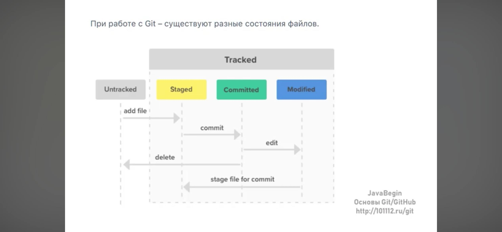
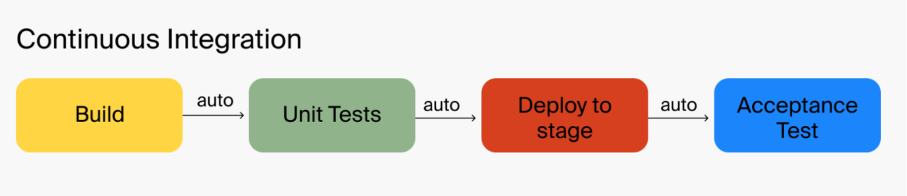
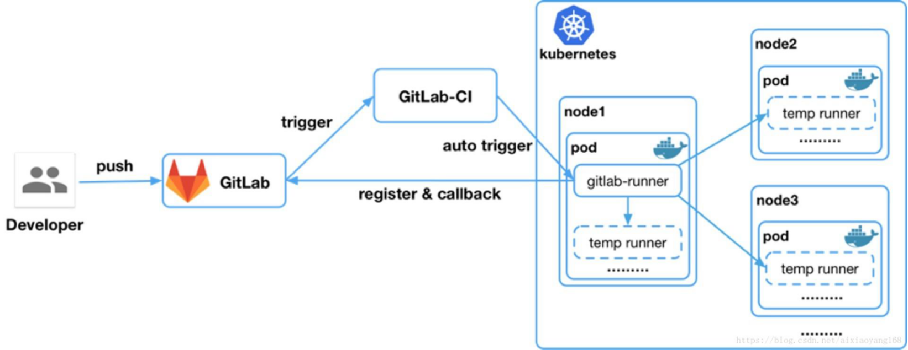

## 09.07.2026
сегодня делал упражнения с гитом, конкретнее git rebase -i
видос git rebase -> https://youtu.be/smUBOQhG1IM?si=hOiobfJ8VQosWnm3

## 10.07.2026
Сегодня чуть все не поломал изза версий, нужно быть аккуратнее, смотреть все из корня и несколько раз проверять, что я обновляю
вчера посморел очень интересный курс по ci cd и тимсити, нужно будет проделать домашки в свободное время, а пока что читать/узнавать/смотреть все про кубер

## 13.07.2026
Сегодня смотрю гайды по тимсити и повторяю на своем компе
КУРС: 3728
построил очень простой пайалайн
- проверка занят ли порт на котором крутиться приложение
- если занят, то удаляем, если нет, идем дальше
- запуск из докер файла внутри проекта
- логи
все это собрано в одном шаге, не знаю насколько это хорошо

## 14.07.2026
Сегоня собрал новый сценарий в тимсити по дз номер 1 и запушил вот сюда 
https://github.com/Skwoznyak/simple-ps1-script-for-teamcity/tree/publish-docker-image-in-github-container-registory

второй урок начал, но было уже совсем поздно, не успеваю, продолжу завтра.
За сегодня написал .yml файлы, завтра запущу minikube и буду пробовать доделать дз.

## 15.07.2026
сегодня смотрел видосы по куберу, развернул его в докере, открыл дашборд, запустил сервис, ингрес, деплоймент
все доступно в этом репо, та весь прогресс по куберу, но в разных ветках https://github.com/Skwoznyak/work-with-k8s

## 16.07.2026
файловая система в гит
https://youtu.be/VUs1mNUBjvk?si=t_E8HHztK9dsCLdp


## 17.07.2026
сегодня сделал вторую домашку по куберу, а так же написал огромную шпору по команда с помощью чата гпт, не думаю что она будет мне нужна, но тем не менее)

вторая домашка - https://github.com/Skwoznyak/work-with-k8s в ветке up-app-in-k8s

## 18.07.2026
сделал третью домашку по куберу

## 20.07.2026
утром почитал ответы на свои вопросы, пробегусь по тому что коммитил за все время
планирую сделать домашку TeamCity и k8s

лайфцикл кубера


## 23.07.2026
процесс CI


Описание конвейера -
 .gitlab-ci.yml

stages:
  - build
  - test

variables:
  GRADLE_OPTS: "-Dorg.gradle.daemon=false"
 before_script:
- GRADLE_USER_HOME="$(pwd)/.gradle"
- export GRADLE_USER_HOME
 build:
  stage: build
  script: gradle --build-cache assemble
  cache:
    key: "$CI_COMMIT_REF_NAME"
    policy: push
  paths:
    - build
    - .gradle
test:
  stage: test
  script: gradle check
  cache:
    key: "$CI_COMMIT_REF_NAME"
    policy: pull
  paths:
  - build
  - .gradle

выполнение задач


## 24.07.2026
Сегодня наконец-то разобрался и понял логику работы дсо и ифт, как работает билд и деплой
билд в дсо - собирает новую версию образа и отправляет ее в хранилище
деплой в дсо - забирает билд по указанной в параметрах версии и после деплоит ее на деве
потом мы идем в иф
и там делаем деплой с перекладчиком и все переносится на ифт, а в логах можно посмотреть что и когда запустилось

читаю книгу по линуксу, точнее только начал( уверен что, когда стажировка кончится я не смогу найти другую работу, знаний невероятно мало((

## 25.07.2026 00:15 - накатил себе убунту линукс

## 26.07.2026

изучаю убунту линукс

Зомби-процесс (Zombie, состояние Z)

Зомби-процесс — это дочерний процесс, который уже завершил выполнение, но его родительский процесс ещё не вызвал wait()/waitpid(), поэтому запись о процессе остаётся в таблице процессов.

Особенности:
- не использует CPU;
- не занимает оперативную память (кроме небольшой записи в таблице процессов);
- отображается в состоянии Z или <defunct>.

Когда зомби мало (1–2 процесса) — это нормально и обычно не вызывает проблем.

Если зомби становится очень много (сотни или тысячи), может переполниться таблица процессов, из-за чего система не сможет создавать новые процессы.

Убрать зомби напрямую нельзя — процесс уже завершился.
Возможные способы:
- родительский процесс должен вызвать wait()/waitpid();
- завершить родительский процесс (kill <PPID>), после чего systemd (PID 1) "усыновит" зомби и очистит его;
- перезагрузить систему.
разобрал strace

```
strace → какие системные вызовы сделала программа (обращения к ядру).
```

ltrace
```
ltrace → какие функции библиотек вызвала программа.
```

## шпора по top


## шпора по htop


## 28.07.2026
сегодня сдали первую таску по jfr и аи, почитал про пуш форвард как он работает

```
Было:
(main)
  o - A
       \
        o - B - o - C  (feature)

Стало после Fast-Forward:
o - A - o - B - o - C  (main, feature)

```
````markdown
## Команда `ls -la`

Показывает подробную информацию обо **всех** файлах и папках (включая скрытые).

- `-l` — подробный (long) формат.
- `-a` — показать все файлы, включая скрытые (`.`).

### Пример

```text
drwxrwxr-x 2 kirill52 kirill52 4096 Jul 28 21:24 .
-rw-rw-r-- 1 kirill52 kirill52    0 Jul 28 21:28 my.txt
````

### Расшифровка строки

```text
drwxrwxr-x 2 kirill52 kirill52 4096 Jul 28 21:24 .
│─────────│ │ │        │        │    │           │
│         │ │ │        │        │    │           └─ имя файла/каталога
│         │ │ │        │        │    └──────────── дата изменения
│         │ │ │        │        └───────────────── размер (байт)
│         │ │ │        └────────────────────────── группа
│         │ │ └─────────────────────────────────── владелец
│         │ └───────────────────────────────────── количество hard links
└──────────────────────────────────────────────── права и тип файла
```

### Тип файла

* `-` — обычный файл
* `d` — директория
* `l` — символическая ссылка

### Права доступа

```text
r - чтение (read)
w - запись (write)
x - выполнение (execute)
```

Пример:

```text
rwx rwx r-x
│   │   └─ права остальных
│   └───── права группы
└───────── права владельца
```

### Специальные каталоги

* `.` — текущая директория.
* `..` — родительская директория.

### Полезно помнить

* `total` — суммарное количество блоков, занимаемых файлами в каталоге.
* Размер каталога (`4096`) — это размер самой директории, а **не** всех файлов внутри.

```
```

## 17.08.2026
# Пятичасовй гайд по куберу


## 19.08.2026

## 1. Виртуализация и контейнеризация

### Виртуализация

Виртуализация позволяет запускать несколько **виртуальных машин (VM)** на одном физическом сервере.

У каждой виртуальной машины есть:

* виртуальный CPU;
* виртуальная RAM;
* виртуальный диск;
* виртуальная сетевая карта;
* собственная операционная система;
* **собственное ядро ОС (kernel)**.

Упрощённая схема:

```text
Физический сервер
│
└── Hypervisor
    │
    ├── VM №1
    │   ├── Ubuntu
    │   ├── Linux Kernel
    │   └── приложение
    │
    └── VM №2
        ├── Windows
        ├── Windows Kernel
        └── приложение
```

### Hypervisor

**Hypervisor** — программный слой, который позволяет создавать и запускать виртуальные машины, распределяя между ними физические ресурсы компьютера.

Примеры технологий виртуализации:

* KVM;
* Hyper-V;
* VMware ESXi.

---

## 2. Что такое ядро — Kernel

**Ядро (kernel)** — центральная часть операционной системы.

Оно управляет:

* процессами;
* CPU;
* оперативной памятью;
* файловыми системами;
* сетью;
* устройствами;
* правами доступа;
* системными вызовами;
* namespaces;
* cgroups.

Программы обычно не управляют железом напрямую.

Например:

```text
curl
 │
 ▼
Linux Kernel
 │
 ▼
сетевое устройство
```

Или:

```text
Программа
    │
    │ хочу выделить память
    ▼
Kernel
    │
    ▼
RAM
```

Версию ядра Linux можно посмотреть:

```bash
uname -r
```

Важно:

> Linux kernel и Ubuntu — не одно и то же.

Ubuntu — Linux-дистрибутив, включающий ядро Linux, пользовательские программы, библиотеки, package manager, конфигурацию и т. д.

---

## 3. Контейнеризация

В отличие от VM, Linux-контейнер обычно **не имеет собственного ядра**.

Несколько контейнеров используют ядро Linux хост-машины:

```text
                Linux Kernel
                 ↑    ↑    ↑
                 │    │    │
              Alpine Ubuntu nginx
              container containers
```

Поэтому контейнеры обычно легче виртуальных машин.

Упрощённо:

```text
VM:

приложение
библиотеки
операционная система
собственное ядро
-------------------
Hypervisor


Container:

приложение
библиотеки
-------------------
ядро Linux хоста
```

---

## 4. Что такое Host

**Host (хост)** — машина, на которой что-либо запускается.

Например, мой компьютер с Ubuntu является Docker host:

```text
Ubuntu Host
│
├── Docker
├── Container A
├── Container B
└── Container C
```

В Kubernetes машины кластера называются **Nodes**.

---

# 5. Что такое контейнер

Контейнер — это не маленькая полноценная виртуальная машина.

В Linux контейнер можно упрощённо представить как:

> Изолированный процесс или группу процессов, которым Linux создаёт отдельное представление части системы с помощью namespaces и контролирует ресурсы с помощью cgroups.

То есть тезис:

> «Контейнер — изолированная сущность, работающая за счёт namespaces и cgroups»

в целом правильный, но упрощённый.

Более точно:

```text
Container
│
├── Linux processes
├── namespaces
├── cgroups
├── filesystem
└── network configuration
```

---

# 6. Namespaces

**Namespaces** — механизм ядра Linux для изоляции системных ресурсов между процессами.

Главная идея:

> Namespace отвечает на вопрос: «Что процесс видит?»

Основные namespaces:

```text
PID  → процессы
NET  → сеть
MNT  → mount points / файловые монтирования
UTS  → hostname
IPC  → IPC
USER → пользователей и UID/GID
```

Например, PID namespace позволяет процессу внутри контейнера видеть:

```text
PID 1 nginx
PID 5 worker
PID 6 worker
```

Хотя на самом хосте эти процессы могут иметь совершенно другие PID:

```text
PID 1    systemd
PID 1000 sshd
PID 5000 nginx
PID 5001 nginx-worker
```

Контейнер видит своё представление процессов.

---

# 7. `lsns`

`lsns` — Linux-команда для просмотра namespaces.

Например:

```bash
lsns
```

Показать только network namespaces:

```bash
lsns -t net
```

Здесь:

```text
lsns → команда
-t   → опция
net  → значение опции, тип namespace
```

То есть:

```bash
lsns -t net
```

означает:

> Покажи namespaces типа `net`.

Пример вывода:

```text
NS          TYPE NPROCS PID
4026531833  net  104    2512
```

Где:

* `NS` — ID namespace;
* `TYPE` — его тип;
* `NPROCS` — количество процессов;
* `PID` — один из процессов в namespace.

Важно:

> Namespaces — технология Linux, а не Docker.

Например, Firefox/Snap тоже используют namespaces для sandboxing.

Docker лишь активно использует namespaces для создания контейнерной изоляции.

---

# 8. Cgroups

**cgroups (control groups)** — механизм Linux для управления и ограничения ресурсов процессов.

Главная идея:

> Namespaces определяют, **что процесс видит**, а cgroups — **сколько ресурсов процесс может использовать/как ресурсы учитываются и распределяются**.

Например:

```text
Container A
RAM limit = 512 MB

Container B
RAM limit = 1 GB
```

Или ограничения CPU.

В Docker:

```bash
docker run --memory=512m nginx
```

В Kubernetes встречается:

```yaml
resources:
  requests:
    memory: "256Mi"
    cpu: "100m"

  limits:
    memory: "512Mi"
    cpu: "500m"
```

На нижнем уровне container runtime и Linux используют cgroups для реализации соответствующих ограничений и учёта ресурсов.

---

# 9. Docker, containerd и runc

### Docker

Docker — высокоуровневая платформа для работы с контейнерами.

Например:

```bash
docker build
docker run
docker ps
docker pull
docker push
docker logs
```

Docker предоставляет удобный интерфейс пользователю и множество дополнительных возможностей.

---

### containerd

**containerd** — container runtime/демон, отвечающий за жизненный цикл контейнеров и работу с контейнерными образами.

Упрощённо он занимается:

```text
получение image
      ↓
хранение image
      ↓
подготовка filesystem
      ↓
создание контейнера
      ↓
запуск
      ↓
остановка
      ↓
удаление
```

Упрощённая цепочка Docker:

```text
Пользователь
    │
    │ docker run nginx
    ▼
Docker
    │
    ▼
containerd
    │
    ▼
runc
    │
    ▼
Linux Kernel
    │
    ├── namespaces
    ├── cgroups
    └── process nginx
```

### runc

`runc` — более низкоуровневый OCI runtime, который непосредственно запускает контейнерный процесс согласно переданной конфигурации.

Упрощённо:

```text
Docker
   ↓
containerd
   ↓
runc
   ↓
Linux
```

---

## 10. containerd в Kubernetes

Kubernetes не обязан использовать Docker.

Современная схема часто выглядит примерно так:

```text
Kubernetes
    ↓
kubelet
    ↓
containerd
    ↓
runc
    ↓
Linux Kernel
```

Поэтому на Kubernetes-node можно встретить:

```bash
systemctl status containerd
```

`containerd` является важной частью контейнерной инфраструктуры Kubernetes.

---

# 11. Alpine Linux в контейнере

Alpine Linux — маловесный Linux-дистрибутив, часто используемый в контейнерах.

Например:

```dockerfile
FROM alpine:3.20
```

В Alpine image находятся пользовательские компоненты:

```text
/bin
/etc
/lib
/usr
apk
BusyBox
musl
...
```

Но отдельное ядро Linux для контейнера не загружается.

Контейнер Alpine использует **Linux kernel хост-машины**.

```text
Ubuntu Host
│
├── Linux Kernel
│       ↑
│       │
│   Alpine Container
│
├── /bin
├── /lib
├── /etc
└── /usr
```

Это можно проверить.

На хосте:

```bash
uname -r
```

В контейнере:

```bash
uname -r
```

Контейнер видит ядро хоста.

При этом:

```bash
cat /etc/os-release
```

в контейнере покажет Alpine Linux.

Таким образом:

```text
userspace → Alpine
kernel    → Linux kernel хоста
```

---

# 12. Основные каталоги Linux

В Alpine-контейнере:

```text
/bin
/dev
/etc
/home
/lib
/media
/mnt
/opt
/proc
/root
/run
/sbin
/srv
/sys
/tmp
/usr
/var
```

Это не только библиотеки.

Основное назначение:

| Каталог    | Назначение                                             |
| ---------- | ------------------------------------------------------ |
| `/bin`     | основные команды/исполняемые программы                 |
| `/lib`     | основные библиотеки                                    |
| `/etc`     | конфигурационные файлы                                 |
| `/home`    | домашние каталоги пользователей                        |
| `/root`    | домашний каталог root                                  |
| `/usr`     | программы, библиотеки и другие пользовательские данные |
| `/usr/bin` | большое количество исполняемых программ                |
| `/usr/lib` | библиотеки                                             |
| `/var`     | изменяемые данные, кеши, логи и т. д.                  |
| `/tmp`     | временные файлы                                        |
| `/dev`     | представление устройств                                |
| `/proc`    | информация от ядра о процессах и системе               |
| `/sys`     | интерфейс к объектам и информации ядра                 |
| `/run`     | runtime-данные                                         |
| `/mnt`     | место для монтирования                                 |
| `/media`   | съёмные/монтируемые носители                           |
| `/opt`     | дополнительное ПО                                      |
| `/sbin`    | системные программы                                    |

---

# 13. Package manager Alpine — apk

В Ubuntu/Debian используется:

```bash
apt
```

В Alpine:

```bash
apk
```

Поэтому:

```bash
apt install curl
```

в Alpine не работает.

Правильно:

```bash
apk add curl
```

---

## 14. Откуда Alpine скачивает пакеты

Список репозиториев Alpine можно посмотреть:

```bash
cat /etc/apk/repositories
```

Например:

```text
https://dl-cdn.alpinelinux.org/alpine/v3.20/main
https://dl-cdn.alpinelinux.org/alpine/v3.20/community
```

При:

```bash
apk add curl
```

`apk` обращается к настроенным репозиториям Alpine.

Сначала получает индексы пакетов:

```text
APKINDEX.tar.gz
```

Затем находит `curl` и необходимые зависимости.

Например:

```text
curl
├── libcurl
├── ca-certificates
├── brotli-libs
├── c-ares
├── libunistring
├── libidn2
├── nghttp2-libs
├── libpsl
└── zstd-libs
```

Package manager самостоятельно разрешает зависимости и устанавливает их.

---

# 15. WSL

**WSL — Windows Subsystem for Linux.**

Linux-контейнерам нужны возможности Linux kernel:

* namespaces;
* cgroups;
* Linux system calls;
* Linux networking и т. д.

Windows использует Windows kernel.

Поэтому для запуска Linux-контейнеров на Windows необходима Linux-среда.

WSL 2 предоставляет настоящее Linux kernel в лёгкой виртуализированной среде.

Упрощённо:

```text
Windows
│
├── Windows Kernel
│
└── WSL 2
    │
    └── Linux Kernel
         │
         └── Docker
              │
              ├── Alpine
              └── nginx
```

На обычном Linux-хосте дополнительный WSL не нужен:

```text
Ubuntu
   ↓
Linux Kernel
   ↓
Docker
   ↓
Containers
```

---

# 16. Multi-stage Docker build

Пример:

```dockerfile
FROM golang AS builder

WORKDIR /src
COPY . .

RUN go build -o myapp


FROM alpine

COPY --from=builder /src/myapp /myapp

CMD ["/myapp"]
```

Первый stage:

```text
STAGE 1 — builder

golang image
├── Go compiler
├── dependencies
├── исходный код
└── myapp
```

После второго `FROM` начинается новый stage:

```text
STAGE 2

Alpine
```

Команда:

```dockerfile
COPY --from=builder /src/myapp /myapp
```

копирует только необходимый файл из первого stage во второй.

Получается:

```text
STAGE 1                       STAGE 2

Go compiler
dependencies
source
myapp ─────────────────────→ myapp
                              +
                            Alpine
```

Финальный image:

```text
Alpine
└── myapp
```

В него не попадают:

```text
Go compiler
исходники
остальные файлы builder
```

---

## 17. Куда девается первый stage

Нужно различать:

```text
FINAL IMAGE
```

и:

```text
BUILD CACHE
```

Первый stage **не является частью файловой системы финального image**.

Однако Docker/BuildKit может сохранить результаты промежуточных этапов в build cache.

Например:

```text
Docker / BuildKit storage
│
├── Final image
│   ├── Alpine
│   └── myapp
│
└── Build cache
    └── данные предыдущей сборки
```

Благодаря этому при следующем:

```bash
docker build .
```

Docker может показать:

```text
CACHED
```

и не выполнять неизменившийся шаг повторно.

Неиспользуемый build cache можно очищать, например:

```bash
docker builder prune
```

Поэтому правильная формулировка:

> Первый stage не входит в финальный image, но данные его сборки могут отдельно сохраняться BuildKit/Docker в build cache.

---

# 18. Основы сети

Для сетевого взаимодействия используются различные понятия:

```text
MAC
 ↓
локальное канальное взаимодействие

IP
 ↓
адресация и маршрутизация между сетями

Port
 ↓
конкретная служба/приложение

DNS
 ↓
имя → IP
```

Например:

```text
192.168.0.103:8080
```

где:

```text
192.168.0.103 → IP
8080          → port
```

---

# 19. Что такое сетевой интерфейс

**Сетевой интерфейс** — объект сетевого стека операционной системы, через который система отправляет и получает сетевой трафик.

Интерфейс может быть связан с физическим устройством или быть полностью виртуальным.

Например:

```text
enp3s0
```

может соответствовать физической Ethernet-карте.

А:

```text
docker0
vethXXXX
```

— виртуальные интерфейсы, созданные Linux.

На интерфейсе могут быть настроены:

* IP-адрес;
* префикс сети;
* MAC;
* состояние UP/DOWN;
* другие сетевые параметры.

Посмотреть интерфейсы:

```bash
ip addr
```

---

# 20. Мои реальные сетевые интерфейсы

На Ubuntu команда:

```bash
ip addr
```

показала:

```text
lo
enp3s0
docker0
Meta
veth03df218
```

Основные интересующие нас сейчас:

```text
enp3s0
docker0
veth03df218
```

---

## 21. enp3s0

У интерфейса:

```text
enp3s0
```

IP:

```text
192.168.0.103/24
```

Это сетевой интерфейс Ubuntu в обычной локальной сети.

Упрощённо:

```text
Ubuntu
192.168.0.103
      │
    enp3s0
      │
      ▼
    роутер
      │
      ▼
  Интернет
```

MAC:

```text
60:a4:4c:3f:cd:09
```

---

# 22. Network namespace

Network namespace позволяет процессам иметь отдельное представление сетевого окружения.

В нём могут быть свои:

* сетевые интерфейсы;
* IP-адреса;
* routing table;
* loopback;
* сокеты/порты и другие элементы сетевого стека.

Например:

```text
Container A
Network Namespace A
│
├── eth0
├── 172.17.0.2
└── :80


Container B
Network Namespace B
│
├── eth0
├── 172.17.0.3
└── :80
```

Поэтому оба контейнера могут одновременно слушать порт `80`.

---

# 23. Почему два контейнера могут использовать :80

Без необходимого разделения сетевого пространства попытка двух приложений слушать одну и ту же конфликтующую комбинацию адреса/порта может закончиться:

```text
Address already in use
```

Но у контейнеров разные network namespaces.

Поэтому:

```text
Container A
172.17.0.2:80

Container B
172.17.0.3:80
```

не конфликтуют.

Однако при публикации портов на host:

```bash
docker run -p 8080:80 nginx
```

получается:

```text
HOST                  CONTAINER

:8080 ──────────────→ :80
```

Второй контейнер нельзя одновременно привязать к той же конфликтующей комбинации на хосте:

```bash
docker run -p 8080:80 nginx
```

потому что host port `8080` уже занят первой публикацией.

Можно:

```bash
docker run -p 8080:80 nginx
docker run -p 8081:80 nginx
```

Тогда:

```text
HOST                  CONTAINERS

:8080 ───────────────→ A :80
:8081 ───────────────→ B :80
```

---

# 24. Что такое veth pair

**veth = virtual Ethernet.**

`veth pair` — два связанных виртуальных сетевых интерфейса Linux.

Условно:

```text
[veth A] <================> [veth B]
```

Трафик, отправленный через один конец пары, появляется на другом.

Docker может поместить один конец в network namespace контейнера.

Там он обычно называется:

```text
eth0
```

Другой конец остаётся на host и выглядит примерно:

```text
veth03df218
```

То есть:

```text
           VETH PAIR

CONTAINER                   HOST

   eth0 <==============> veth03df218
```

Важно:

`veth pair` — не отдельный третий объект между `eth0` и `veth...`.

Это название **пары этих двух связанных интерфейсов**.

---

# 25. eth0 контейнера

Контейнер видит внутри своего network namespace интерфейс:

```text
eth0
```

Например:

```text
eth0
inet 172.17.0.2/16
```

Можно условно воспринимать `eth0` как виртуальную сетевую карту контейнера.

Но отдельной физической сетевой карты для контейнера нет.

---

# 26. Docker bridge — docker0

На host команда:

```bash
ip addr
```

показала:

```text
docker0
inet 172.17.0.1/16
```

`docker0` — Linux bridge, созданный Docker для стандартной bridge-сети.

Его можно приблизительно представить как **виртуальный сетевой коммутатор**:

```text
Container A ── veth ──┐
                      │
Container B ── veth ──┼── docker0
                      │
Container C ── veth ──┘
```

В моём выводе:

```text
veth03df218@if2
...
master docker0
```

`master docker0` показывает, что host-сторона этого veth подключена к bridge `docker0`.

---

# 27. Реальная Docker-сеть на моём ПК

На host:

```text
enp3s0
192.168.0.103/24

docker0
172.17.0.1/16

veth03df218
```

Упрощённо:

```text
                 ALPINE
            ┌───────────────┐
            │ eth0          │
            │ 172.17.0.X    │
            │      ●        │
            └──────║────────┘
                   ║
                   ║ veth pair
                   ║
            ┌──────●──────────────┐
            │ veth03df218         │
            │      │              │
            │      ▼              │
            │   docker0           │
            │   172.17.0.1        │
            │      │              │
            │      ▼              │
            │   enp3s0            │
            │   192.168.0.103     │
            │                     │
            │    UBUNTU HOST      │
            └──────────┬──────────┘
                       │
                       ▼
                     роутер
                       │
                       ▼
                    Интернет
```

---

# 28. Socket

Программа вроде `curl` не работает непосредственно с `eth0`.

Она использует сетевые API ядра и создаёт **socket**.

Socket можно упрощённо представить как программную точку сетевого взаимодействия, предоставляемую ядром процессу.

Например:

```text
curl
 │
 │ socket
 ▼
Linux networking stack
 │
 ▼
сетевой интерфейс
```

Для TCP `curl` может попросить ядро установить соединение с:

```text
IP Google : port 80
```

---

# 29. Как контейнер Alpine вышел в интернет

В контейнере было выполнено:

```bash
curl google.com
```

Упрощённый путь:

```text
curl
 ↓
socket
 ↓
Linux networking stack
 ↓
eth0 контейнера
 ║
 ║ veth pair
 ║
veth на host
 ↓
docker0
 ↓
маршрутизация/NAT хоста
 ↓
enp3s0
 ↓
роутер
 ↓
Интернет
 ↓
Google
```

Важно:

> Network namespace изолирует сетевое окружение контейнера, но это не означает, что контейнер не имеет доступа к сети.

Docker создаёт необходимое сетевое подключение.

---

# 30. NAT

Для выхода контейнера в интернет Docker обычно использует NAT на host.

Контейнер имеет внутренний адрес Docker-сети, например:

```text
172.17.0.2
```

Но внешняя сеть не обязана знать маршрут к этой внутренней Docker-сети.

Host имеет адрес:

```text
192.168.0.103
```

Поэтому при выходе наружу Linux/Docker может преобразовать сетевые адреса таким образом, чтобы трафик контейнера вышел через host.

Упрощённо:

```text
Container
172.17.0.2
    ↓
NAT на host
    ↓
Host
192.168.0.103
    ↓
Internet
```

---

# 31. DNS

**DNS — Domain Name System.**

DNS позволяет находить IP-адреса и другие данные по доменным именам.

Например:

```text
google.com
    ↓
   DNS
    ↓
IP-адрес Google
```

Приложению в конечном итоге нужен сетевой адрес, но человеку удобнее использовать:

```text
google.com
```

чем запоминать IP.

В Docker и Kubernetes DNS особенно важен, потому что сервисы удобно находить по именам.

---

# 32. Почему IP Pod'а в Kubernetes может измениться

Pod является эфемерной сущностью.

Например:

```text
Pod backend
10.244.1.27
```

Pod умер.

Kubernetes создаёт новый:

```text
Pod backend
10.244.2.14
```

Новый Pod может получить другой IP.

Поэтому плохо строить взаимодействие сервисов на жёстко прописанном Pod IP:

```text
10.244.1.27
```

В Kubernetes для стабильной точки доступа используется **Service**.

```text
Client
  │
  │ backend
  ▼
Service
  │
  ├── Pod A
  └── Pod B
```

Клиент может обращаться по DNS-имени сервиса, например:

```text
backend:8080
```

вместо знания IP конкретного Pod.

---

# 33. IP и маска подсети

IPv4-адрес состоит из 32 бит.

Например:

```text
192.168.1.10
```

В двоичном виде это четыре октета по 8 бит:

```text
192       168       1         10

11000000  10101000  00000001  00001010
```

Всего:

```text
8 + 8 + 8 + 8 = 32 бита
```

---

# 34. `/24`

Запись:

```text
192.168.1.10/24
```

означает, что первые 24 бита являются сетевым префиксом.

Упрощённо:

```text
192.168.1 . 10
─────────   ──
 сеть       host-часть
```

Маска:

```text
255.255.255.0
```

в двоичном виде:

```text
11111111.11111111.11111111.00000000
```

Количество единиц:

```text
8 + 8 + 8 = 24
```

Поэтому:

```text
255.255.255.0
```

соответствует `/24`.

Например:

```text
192.168.1.10/24
192.168.1.20/24
192.168.1.200/24
```

относятся к сети:

```text
192.168.1.0/24
```

А:

```text
192.168.2.10/24
```

относится уже к другой `/24` сети.

---

# 35. CIDR

Записи вида:

```text
192.168.1.0/24
10.244.0.0/16
10.96.0.0/12
```

используют **CIDR notation**.

Число после `/` показывает длину сетевого префикса в битах.

В Kubernetes CIDR используется постоянно для описания сетевых диапазонов.

---

# 36. Nginx

**Nginx** — серверное программное обеспечение, которое может выполнять несколько ролей.

Основные для текущего уровня:

* web server;
* reverse proxy;
* load balancer;
* TLS termination;
* caching.

---

# 37. Nginx как Web Server

Nginx может непосредственно отдавать файлы пользователю.

Например:

```text
Browser
   ↓
Nginx
   ↓
index.html
```

Часто так раздают статический frontend.

---

# 38. Reverse Proxy

**Reverse proxy** — сервер-посредник, который принимает клиентские запросы перед backend-сервисами и перенаправляет их нужному сервису.

Например, есть:

```text
Frontend → :3000
Backend  → :8080
Admin    → :9000
```

Снаружи ставим Nginx:

```text
                Nginx
                  │
       ┌──────────┼──────────┐
       ▼          ▼          ▼
   Frontend    Backend     Admin
    :3000       :8080      :9000
```

Можно настроить:

```text
example.com/       → frontend:3000
example.com/api/   → backend:8080
example.com/admin/ → admin:9000
```

Тогда пользователь делает:

```text
GET example.com/api/users
```

Nginx принимает запрос и отправляет его backend:

```text
Пользователь
     │
     ▼
   Nginx
     │
     ▼
Backend :8080
```

Ответ:

```text
Backend
   ↓
Nginx
   ↓
Пользователь
```

Пользователю не обязательно знать реальный IP и порт backend.

Сервисы за Nginx могут находиться как на одной машине, так и на разных машинах.

Упрощённо:

> Есть несколько сервисов за Nginx, а Nginx принимает внешние запросы и проксирует их нужным сервисам согласно конфигурации.

---

# 39. Forward Proxy и Reverse Proxy

Forward proxy:

```text
Клиенты
   ↓
Proxy
   ↓
Internet
   ↓
Серверы
```

Он представляет клиентскую сторону перед внешними ресурсами.

Reverse proxy:

```text
Internet
   ↓
Nginx
   ↓
Backend-серверы
```

Он представляет серверную сторону перед клиентами.

---

# 40. TLS / HTTPS

HTTPS — HTTP поверх TLS.

TLS обеспечивает защищённое сетевое соединение, включая шифрование и проверку подлинности сервера через сертификаты.

Например:

```text
Пользователь
     │
     │ HTTPS / TLS
     ▼
   Nginx
     │
     ▼
 Backend
```

Nginx может принимать HTTPS-соединение и работать с TLS-сертификатом.

Когда TLS завершается на reverse proxy, это часто называют:

**TLS termination**.

---

# 41. Load Balancing

Если одного backend недостаточно:

```text
Backend 1
Backend 2
Backend 3
```

Nginx может распределять запросы между ними:

```text
             Nginx
               │
       ┌───────┼───────┐
       ▼       ▼       ▼
   Backend1 Backend2 Backend3
```

Например:

```text
Request 1 → Backend 1
Request 2 → Backend 2
Request 3 → Backend 3
```

Это называется:

**Load balancing — балансировка нагрузки.**

---

# 42. HTTP Headers

HTTP-запрос содержит не только путь.

Например:

```http
GET /users HTTP/1.1
Host: example.com
User-Agent: Firefox
Accept: application/json
Authorization: Bearer ...
```

Примеры HTTP headers:

```text
Host
User-Agent
Accept
Authorization
Cookie
```

Nginx может:

* читать headers;
* добавлять;
* изменять;
* удалять;
* передавать backend.

---

# 43. Кеширование

Nginx в определённых конфигурациях может кешировать ответы.

Без кеша:

```text
User → Nginx → Backend
User → Nginx → Backend
User → Nginx → Backend
```

С кешем:

```text
Первый запрос:

User
 ↓
Nginx
 ↓
Backend
 ↓
response

Nginx сохраняет response
```

Последующие подходящие запросы могут обслуживаться:

```text
User
 ↓
Nginx
 ↓
Cache
```

без обращения к backend.

---

# 44. Общая роль Nginx

В итоге архитектура может выглядеть:

```text
                     INTERNET
                         │
                         ▼
                  ┌─────────────┐
                  │    Nginx    │
                  │             │
                  │ TLS         │
                  │ Proxy       │
                  │ Routing     │
                  │ Balancing   │
                  │ Caching     │
                  └──────┬──────┘
                         │
             ┌───────────┼───────────┐
             ▼           ▼           ▼
         Frontend     Backend     Backend
```

---

# 45. Связь Nginx с Kubernetes

В Kubernetes встретится похожая идея:

```text
Internet
   ↓
Ingress / Gateway
   ↓
Service
   ↓
Pods
```

Ingress-контроллером исторически часто мог выступать Nginx, хотя существуют и другие реализации.

---

# 46. Общая картина контейнера

Всё изученное можно собрать:

```text
                       HOST
              ┌───────────────────┐
              │                   │
              │   Linux Kernel    │
              │                   │
              │   namespaces      │
              │   cgroups         │
              │                   │
              │   containerd      │
              │       │           │
              │       ▼           │
              │   Container       │
              │       │           │
              │     nginx         │
              │                   │
              └───────────────────┘
```

Контейнер:

```text
Container
│
├── processes
├── filesystem
├── namespaces
├── cgroups
└── network
```

---

# 47. Общая картина Docker Networking

```text
                CONTAINER
          ┌─────────────────┐
          │ Network NS      │
          │                 │
curl ─────┤                 │
          │      eth0 ●     │
          └───────────║─────┘
                      ║
                      ║ veth pair
                      ║
          ┌───────────●─────────────┐
          │       vethXXXX          │
          │           │             │
          │           ▼             │
          │        docker0          │
          │           │             │
          │           ▼             │
          │      routing / NAT      │
          │           │             │
          │           ▼             │
          │        enp3s0           │
          │                         │
          │       UBUNTU HOST       │
          └───────────┬─────────────┘
                      │
                      ▼
                    Router
                      │
                      ▼
                  Internet
```

---

# 48. Ключевые определения для запоминания

**Kernel** — ядро ОС, управляющее процессами, памятью, сетью, устройствами и другими системными ресурсами.

**Host** — машина, на которой запускаются приложения, VM или контейнеры.

**Hypervisor** — технология/программный слой для запуска виртуальных машин.

**Container** — изолированный процесс или группа процессов, использующие ядро host.

**Namespace** — механизм Linux, изолирующий представление системных ресурсов для процессов.

**cgroups** — механизм Linux для контроля, учёта и ограничения ресурсов процессов.

**Docker** — высокоуровневая платформа для работы с контейнерами.

**containerd** — runtime-демон для управления жизненным циклом контейнеров и образами.

**runc** — низкоуровневый OCI runtime для запуска контейнерного процесса.

**Alpine** — маловесный Linux-дистрибутив, часто используемый как основа контейнерных образов.

**Network interface** — объект сетевого стека ОС для отправки и получения сетевого трафика.

**Network namespace** — изолированное представление сетевого окружения для процессов.

**eth0** — традиционное имя Ethernet-интерфейса; в Docker-контейнере обычно основной виртуальный сетевой интерфейс.

**veth pair** — пара связанных виртуальных Ethernet-интерфейсов.

**docker0** — стандартный Linux bridge Docker для default bridge network.

**Bridge** — программный сетевой мост, соединяющий интерфейсы на канальном уровне.

**Socket** — программный объект ядра, через который процесс взаимодействует по сети.

**IP** — сетевой адрес интерфейса/узла в IP-сети.

**Port** — номер транспортной конечной точки, позволяющий различать сетевые приложения/соединения.

**DNS** — система сопоставления доменных имён с IP-адресами и другими DNS-данными.

**Subnet mask / CIDR** — способ определить, какая часть IP относится к сетевому префиксу.

**NAT** — преобразование сетевых адресов.

**Nginx** — web server и reverse proxy, который также может выполнять балансировку, TLS termination, кеширование и другие функции.

**Reverse proxy** — сервер перед backend-сервисами, принимающий клиентские запросы и проксирующий их нужному backend.

**Load balancer** — распределяет запросы между несколькими экземплярами приложения.

**TLS** — протокол защиты сетевого соединения.

**Build cache** — кеш результатов Docker-сборки, позволяющий повторно использовать неизменившиеся шаги.

---

# 49. Главная мысль

Контейнер не является отдельным компьютером.

В Linux в конечном итоге существуют обычные процессы:

```text
Linux Kernel
    │
    ├── process nginx
    ├── process postgres
    └── process java
```

Контейнерные технологии используют возможности Linux, чтобы эти процессы получили изолированное окружение:

```text
                  Linux Kernel
                       │
          ┌────────────┼────────────┐
          │            │            │
      Container A  Container B  Container C
          │            │            │
      namespaces   namespaces   namespaces
      cgroups      cgroups      cgroups
      filesystem   filesystem   filesystem
      network      network      network
```

Docker/containerd автоматизируют создание и управление этим окружением.

Kubernetes поднимается ещё на один уровень выше и управляет большим количеством контейнеризированных приложений через Pods, Deployments, Services и другие сущности.

Главная цепочка для понимания:

```text
Железо
   ↓
Linux Kernel
   ↓
namespaces + cgroups + networking
   ↓
container runtime
   ↓
containers
   ↓
Pods
   ↓
Kubernetes
```
## 26.08.2026

# ContainerCreating в Kubernetes

`ContainerCreating` — это состояние Pod в Kubernetes, которое означает:

> **Pod уже создан, но Kubernetes ещё не смог запустить контейнер внутри него.**

## Жизненный цикл

Упрощённо процесс выглядит так:

```text
Deployment
    ↓
ReplicaSet
    ↓
Pod
    ↓
ContainerCreating
    ↓
Running
```

На этапе `ContainerCreating` kubelet на ноде подготавливает всё необходимое перед запуском контейнера.

### Что происходит на этом этапе

Kubernetes может:

* скачать Docker/OCI-образ, если его ещё нет на ноде;
* создать контейнер через container runtime;
* смонтировать `ConfigMap`;
* смонтировать `Secret`;
* подключить `PersistentVolume`;
* настроить сеть Pod;
* применить `securityContext`;
* подключить необходимые volumes;
* подготовить namespace и cgroups.

## Если Pod долго находится в `ContainerCreating`

Если Pod несколько секунд находится в `ContainerCreating` — это нормально.

Если он **долго висит** в этом состоянии, нужно искать причину.

Первое, что стоит выполнить:

```bash
kubectl describe pod <pod-name>
```

Внизу вывода будет секция:

```text
Events:
  Type     Reason     Message
  ----     ------     -------
  Normal   Pulling    Pulling image "..."
  Normal   Pulled     Successfully pulled image
  Warning  Failed     ...
```

Именно `Events` обычно показывают, на каком этапе возникла проблема.

## Типичные причины

### Не удалось скачать образ

```text
Failed to pull image
```

или:

```text
ErrImagePull
```

Возможные причины:

* неправильное имя образа;
* неправильный тег;
* нет доступа к registry;
* не настроен `imagePullSecret`;
* registry недоступен.

---

### Проблема с Volume

```text
FailedMount
```

Возможные причины:

* проблема с `PersistentVolume`;
* проблема с `PersistentVolumeClaim`;
* отсутствует `ConfigMap`;
* отсутствует `Secret`;
* Kubernetes не может примонтировать volume.

---

### Проблема с сетью Pod

```text
FailedCreatePodSandBox
```

Обычно это связано с:

* CNI;
* сетевым плагином Kubernetes;
* container runtime;
* проблемами с настройкой сети ноды.

---

## Важно отличать `ContainerCreating` от `CrashLoopBackOff`

`ContainerCreating` означает, что контейнер **ещё не запустился нормально**.

Например:

```text
Pod
 ↓
ContainerCreating
```

На этом этапе приложение внутри контейнера может ещё вообще не выполняться.

А вот:

```text
Pod
 ↓
Running
 ↓
CrashLoopBackOff
```

означает, что контейнер уже запускался, но приложение внутри него завершилось с ошибкой, после чего Kubernetes пытается перезапустить его.

## Пример при деплое новой версии

Если CI/CD job выкатывает новую версию сервиса:

```text
Deployment
    ↓
новый ReplicaSet
    ↓
новый Pod
    ↓
ContainerCreating
```

В этот момент Kubernetes подготавливает новый Pod.

Если всё успешно:

```text
ContainerCreating
    ↓
Running
```

Если возникла проблема, Pod может надолго остаться в `ContainerCreating`.

### Что проверять

```bash
kubectl get pods
```

Затем:

```bash
kubectl describe pod <pod-name>
```

И в первую очередь смотреть:

```text
Events:
```

**Ключевая мысль:**

> `ContainerCreating` — это не ошибка само по себе. Это промежуточное состояние, в котором Kubernetes готовит контейнер к запуску. Если состояние длится слишком долго — смотри `kubectl describe pod` и секцию `Events`.


## 27.08.2026
# Пода зависает в статусе Pending

Это значит кубер принял объект под, но контейнеры не начали запускаться. Чаще всего проблема в том, что шедулер не может подобрать ноду или под ждет какой-то ресур.
На практике помогало через консоль панель кубера убиваьт эти поды и деплоить через орекестрацию\хелм

```
kubectl get pod <pod-name> -n <namespace> -o wide

kubectl describe pod <pod-name> -n <namespace>

kubectl get nodes
```

# Kubernetes: Nodes и Affinity

## Что такое Node

**Node (нода)** — это физическая или виртуальная машина, на которой Kubernetes запускает Pod'ы.

Пример кластера:

```text
Kubernetes Cluster
│
├── Node 1
│   ├── Pod A
│   └── Pod B
│
├── Node 2
│   ├── Pod C
│   └── Pod D
│
└── Node 3
    └── Pod E
```

Когда мы создаём Deployment:

```yaml
replicas: 3
```

мы говорим Kubernetes:

> Нужно запустить 3 экземпляра Pod.

Но на каких именно нодах они будут запущены, решает **kube-scheduler**.

Например:

```text
Node 1 → Pod 1
Node 2 → Pod 2
Node 3 → Pod 3
```

Но Kubernetes может разместить их и так:

```text
Node 1 → Pod 1, Pod 2
Node 2 → Pod 3
Node 3 → пусто
```

Чтобы влиять на выбор ноды, существуют механизмы:

* `nodeSelector`
* `Node Affinity`
* `Pod Affinity`
* `Pod Anti-Affinity`
* `Taints / Tolerations`
* `Topology Spread Constraints`

---

# Affinity

**Affinity** — правила, которые влияют на то, где Kubernetes Scheduler будет размещать Pod.

Основные виды:

```text
Node Affinity
Pod Affinity
Pod Anti-Affinity
```

---

## 1. Node Affinity

**Node Affinity** задаёт правила связи:

```text
Pod → Node
```

Например, есть ноды:

```text
node-1 → disk=ssd
node-2 → disk=hdd
node-3 → disk=ssd
```

Мы хотим запускать приложение только на нодах с SSD.

```yaml
affinity:
  nodeAffinity:
    requiredDuringSchedulingIgnoredDuringExecution:
      nodeSelectorTerms:
        - matchExpressions:
            - key: disk
              operator: In
              values:
                - ssd
```

Scheduler проверит:

```text
node-1 → disk=ssd → подходит
node-2 → disk=hdd → НЕ подходит
node-3 → disk=ssd → подходит
```

Pod будет запущен на `node-1` или `node-3`.

Если подходящих нод нет:

```text
Pod → Pending
```

Например, в `kubectl describe pod` можно увидеть:

```text
0/5 nodes are available:
5 node(s) didn't match Pod's node affinity
```

Это означает, что Scheduler проверил 5 нод и ни одна не удовлетворила требованиям `nodeAffinity`.

---

# 2. Pod Affinity

**Pod Affinity** задаёт связь:

```text
Pod → другой Pod
```

То есть мы говорим Kubernetes:

> Размести этот Pod рядом с определёнными Pod'ами.

Например:

```text
Node 1
├── Redis
└── Backend
```

Мы можем настроить Backend так, чтобы он размещался на той же ноде, где находится Pod с:

```text
app=redis
```

Pod Affinity ищет другие Pod'ы по их **labels**.

---

## topologyKey

Для Pod Affinity Kubernetes должен понимать, что означает **«рядом»**.

Для этого используется:

```yaml
topologyKey: kubernetes.io/hostname
```

`kubernetes.io/hostname` обычно соответствует конкретной Node.

Поэтому:

```text
одинаковый hostname
        ↓
одна Node
```

Следовательно, правило может означать:

> Размести этот Pod на той же Node, где уже находится нужный Pod.

---

# 3. Pod Anti-Affinity

**Pod Anti-Affinity** работает наоборот:

> Не размещай этот Pod рядом с определёнными Pod'ами.

Часто используется для **отказоустойчивости**.

Например, есть:

```yaml
replicas: 3
```

Без Anti-Affinity теоретически возможно:

```text
Node 1
├── Backend 1
├── Backend 2
└── Backend 3
```

Если `Node 1` упадёт, одновременно перестанут работать все три реплики.

Лучше распределить:

```text
Node 1 → Backend 1
Node 2 → Backend 2
Node 3 → Backend 3
```

Для этого можно использовать **Pod Anti-Affinity**.

Логика:

```text
Не запускай мой Pod на Node,
где уже находится Pod моего приложения.
```

Таким образом реплики распределяются между разными нодами.

---

# Required и Preferred

У Affinity есть два важных типа правил.

## required

```yaml
requiredDuringSchedulingIgnoredDuringExecution
```

Это **жёсткое требование**.

Scheduler обязан выполнить условие.

```text
Scheduler
    ↓
ищет Node
    ↓
условие выполняется?
   / \
 да   нет
 ↓     ↓
Run  ищем другую Node
          ↓
    ничего не нашли
          ↓
       Pending
```

То есть `required` потенциально может привести к `Pending`.

---

## preferred

```yaml
preferredDuringSchedulingIgnoredDuringExecution
```

Это **желательное условие**.

Мы говорим Scheduler:

> Желательно разместить Pod таким образом, но если не получится — всё равно запусти его.

```text
preferred
    ↓
подходящая Node есть?
   / \
 да   нет
 ↓     ↓
там   можно выбрать
      другую Node
```

Поэтому `preferred` значительно реже становится причиной `Pending`.

---

# Что означает IgnoredDuringExecution

Например:

```text
requiredDuringSchedulingIgnoredDuringExecution
```

Название можно разбить:

```text
required
DuringScheduling
IgnoredDuringExecution
```

### DuringScheduling

Правило проверяется в момент, когда Scheduler выбирает Node для Pod.

### IgnoredDuringExecution

После запуска Pod изменение условий не обязательно приведёт к его удалению.

Например:

```text
Node:
disk=ssd
```

Pod требует:

```text
disk=ssd
```

Scheduler запускает его.

После этого кто-то меняет label:

```text
disk=hdd
```

Уже запущенный Pod не обязан автоматически удаляться только из-за того, что Node перестала соответствовать этому affinity-правилу.

---

# Как Scheduler выбирает Node

Упрощённо процесс выглядит так:

```text
Deployment
    ↓
создаётся Pod
    ↓
kube-scheduler
    ↓
проверяет Nodes
    │
    ├── хватает CPU?
    ├── хватает RAM?
    ├── подходят Taints/Tolerations?
    ├── подходит nodeSelector?
    ├── подходит Node Affinity?
    ├── подходит Pod Affinity?
    ├── подходит Pod Anti-Affinity?
    └── подходят topology constraints?
    ↓
выбирает подходящую Node
    ↓
Pod назначается на Node
    ↓
запускается контейнер
```

Если Scheduler не может найти подходящую Node:

```text
Pod → Pending
```

---

# Пример Pending из-за Affinity

Допустим, Pod требует:

```text
environment=prod
disk=ssd
```

Есть две ноды:

```text
node-1:
environment=prod
disk=hdd

node-2:
environment=test
disk=ssd
```

`node-1` не подходит из-за:

```text
disk=hdd
```

`node-2` не подходит из-за:

```text
environment=test
```

Получается:

```text
Pod
 ↓
Scheduler
 ↓
node-1 ❌
node-2 ❌
 ↓
нет подходящей Node
 ↓
Pending
```

---

# Как диагностировать

Посмотреть Pod:

```bash
kubectl get pods -n <namespace>
```

Посмотреть подробную информацию:

```bash
kubectl describe pod <pod-name> -n <namespace>
```

Особенно важно смотреть раздел:

```text
Events:
```

Там Scheduler может написать причину:

```text
0/5 nodes are available:
5 node(s) didn't match Pod's node affinity
```

---

Посмотреть доступные ноды:

```bash
kubectl get nodes
```

Посмотреть labels нод:

```bash
kubectl get nodes --show-labels
```

Подробно посмотреть конкретную Node:

```bash
kubectl describe node <node-name>
```

---

# Главное запомнить

```text
Node
↓
машина, на которой работают Pod'ы
```

```text
Node Affinity
↓
На КАКОЙ Node запускать Pod?
```

```text
Pod Affinity
↓
С КАКИМИ Pod'ами желательно запускать мой Pod рядом?
```

```text
Pod Anti-Affinity
↓
С КАКИМИ Pod'ами мой Pod желательно/обязательно НЕ размещать рядом?
```

```text
required
↓
обязательное правило
↓
не получилось выполнить → Pending
```

```text
preferred
↓
желательное правило
↓
не получилось → можно запустить в другом месте
```

И если Pod завис в:

```text
Pending
```

одна из первых команд:

```bash
kubectl describe pod <pod-name> -n <namespace>
```

и смотрим:

```text
Events
```

Именно там Scheduler обычно объясняет, почему он не смог подобрать Node.
